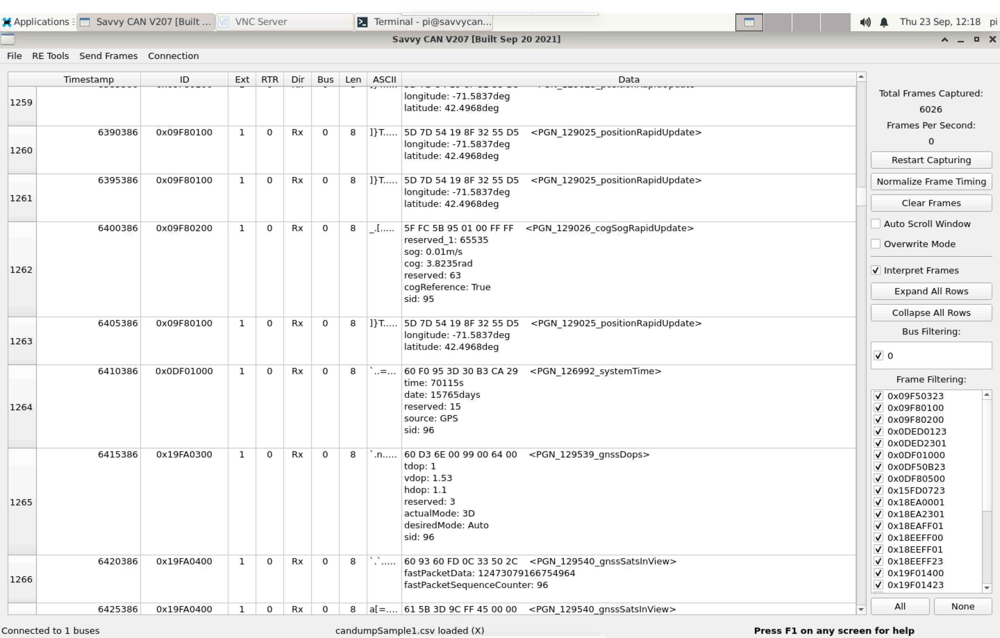

# Overview

`dbc-exporter` is a canboat PGN database DBC exporting tool.
You can use it to export the canboat PGN data into a DBC database.

The DBC file format is a proprietary (but industry standard) means of describing CAN bus messages.
It can be used by most CAN bus analysis and reverse engineering tools to decode and interpret the CAN bus messages.

The screenshot below shows some sample NMEA 2000 bus data decoded using [SavvyCAN](https://github.com/collins80/SavvyCAN/).

# Installation

`dbc-exporter` can be installed as a regular Python package:

    python3 setup.py install

However, most of the time you don't need to install the tool; the DBC file for the latest canboat PGN database can be found in this repo.

# Limitations

NMEA 2000 extends the J1939 protocol to include a Fast packet format that allows for sending up to 223 bytes of data in a number of cojoined messages.
The DBC format does not support this, so the fast packets are detected but not decoded.
ISO 11783 packets are not decoded either.
