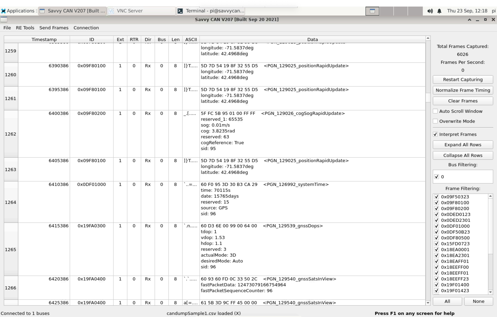

# Overview

`dbc-exporter` is a canboat PGN database DBC exporting tool.
You can use it to export the canboat PGN data into a DBC database.

The DBC file format is a proprietary (but industry standard) means of describing CAN bus messages.
It can be used by most CAN bus analysis and reverse engineering tools to decode and interpret the CAN bus messages.

The screenshot below shows some sample NMEA 2000 bus data decoded using [SavvyCAN](https://github.com/collin80/SavvyCAN/).

# The DBC file

You normally do not need to run this tool: the DBC file for the latest canboat PGN
database is committed at [`docs/canboat.dbc`](../docs/canboat.dbc) and is regenerated by
`make generated`.

# Using the DBC file with cantools

[cantools](https://github.com/cantools/cantools) is a free, open-source CAN toolkit. It
is the recommended way to work with `canboat.dbc` because it fully supports the multiplexing
this database relies on — including the *extended* (nested) multiplexing used for some
proprietary PGNs, which not every tool implements.

Install its command-line tools with pipx (it is the library this exporter is built
on too, but for command-line use pipx keeps it in its own isolated environment):

    pipx install cantools

Then, for example:

    # Inspect the database
    cantools dump docs/canboat.dbc

    # Decode a stream of "candump" frames (Linux SocketCAN)
    candump can0 | cantools decode -m 0x1ffff00 docs/canboat.dbc

    # Live-decode a CAN interface in an ncurses UI
    cantools monitor -m 0x1ffff00 -i socketcan -c can0 docs/canboat.dbc

    # Plot signals over time
    cantools plot docs/canboat.dbc '*'

## Matching frames by PGN: the `-m 0x1ffff00` mask

An NMEA 2000 / J1939 29-bit CAN id is not just the PGN — it also carries a 3-bit
**priority** (top bits) and an 8-bit **source address** (low byte), both of which vary
from frame to frame. A DBC message has a single fixed id, so a plain `cantools decode`
compares the whole id and matches *nothing*.

Pass `-m 0x1ffff00` (`--frame-id-mask`) so cantools compares only the PGN bits — the data
page, PDU format and PDU specific — and ignores priority and source address. (ISO
Transport Protocol frames, PGNs 60160/60416, are PDU1, where the masked byte is a
destination address rather than part of the PGN, so those few frames will not match;
they are transport-layer overhead, not data.)

Proprietary PGNs that share a PGN number across manufacturers are exported as a single
multiplexed message keyed on the 16-bit manufacturer/industry header (and, where the
manufacturer reuses the PGN, a nested proprietary sub-key). cantools then shows only the
signals for the matching manufacturer and sub-protocol.

> **A note on tool support:** DBC multiplexing — especially *extended* multiplexing
> (a multiplexed signal that is itself a multiplexor) — is an advanced feature that not
> every viewer implements fully. SavvyCAN handles basic multiplexing but has known
> limitations with extended multiplexing; cantools handles both, which is why it is
> recommended above.

# Regenerating the DBC

The usual way to (re)generate `docs/canboat.dbc` from `docs/canboat.json` is:

    make -C dbc-exporter

which builds the exporter in an isolated virtual environment under `rel/` and runs it.

To install the `canboat-dbc-exporter` command on its own, use pipx — it is a
command-line tool, so it belongs in its own isolated environment:

    pipx install .

(Avoid the deprecated `python3 setup.py install`: it leaves behind version-pinned
launcher scripts that break when the underlying Python is upgraded.)

# Limitations

NMEA 2000 extends the J1939 protocol with a Fast packet format that carries up to 223
bytes across several co-joined CAN frames. A single DBC message describes one 8-byte
frame, so fast packets cannot be field-decoded; they are exported as a generic message
with a sequence counter and an opaque data field, so the PGN is at least present on the
bus listing.

ISO 11783 (ISO-TP) transport packets are likewise not decoded.
